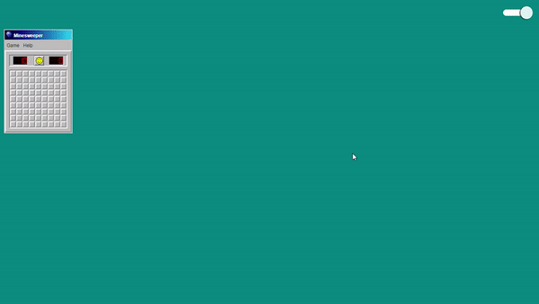

# React MineSweeper

 # Demo

# Content
- [Demo](#Demo)
- [About](#About)
- [Dev](#Dev)

# About

This App was build solely as a exercise to practice the development of a minesweeper with React, together with Styled Components, using Typescript.

Other Stack Components:

- [ESLint](https://eslint.org/)
- [Prettier](https://prettier.io/)

 # Dev 
 [Back](#Content)

### `npm run dev`

Runs CRA webpack in fast Refresh Mode

